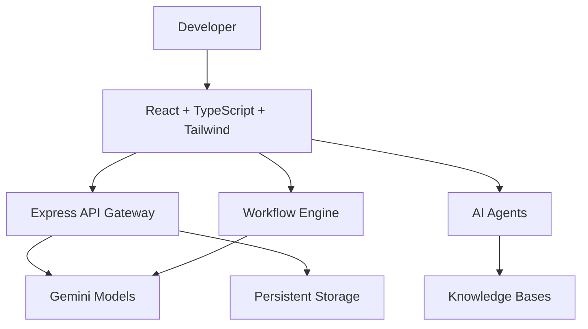

# NeuralVoid

🌐 Live Website: https://ais-pre-xl6iobb6qbtloeu67rkecx-695032611408.asia-southeast1.run.app

⭐ Star this repository if you find it useful.

---

## Collaborative AI Developer Platform

NeuralVoid is a full-stack AI SaaS platform that combines AI-powered developer tools, workflow automation, custom agents, knowledge bases, prompt engineering, SVG generation, and an intelligent workspace-aware copilot into a unified experience.

---

## Key Features

### AI Developer Toolkit

* Text Generation
* Document Summarization
* Grammar Improvement
* PDF Question Answering
* Code Review & Explanation
* SVG Vector Art Compiler

### Prompt Studio

* Save Prompt Templates
* Version History
* Favorites
* Dynamic Variables
* Prompt Testing Playground

### Knowledge Bases

* Document Collections
* Searchable Context
* RAG-Powered Retrieval
* Agent Integration

### Workflow Builder

* Visual AI Pipelines
* Multi-Step Processing
* Node Configuration
* Sequential Execution Engine

### AI Agent Builder

* Custom Agent Creation
* Model Selection
* Knowledge Base Connections
* Persistent Conversation History

### NeuralVoid Copilot

* Context-Aware Assistance
* Platform Guidance
* Troubleshooting Mode
* Workspace Intelligence

### Team Collaboration

* Workspaces
* Role Management
* Shared Resources
* Version Tracking

---

## Architecture

---

## Technology Stack

### Frontend

* React
* TypeScript
* Tailwind CSS

### Backend

* Node.js
* Express

### AI

* Gemini API

### Storage

* Persistent Database Layer

### Authentication

* Email Authentication

## Screenshots

## Dashboard

## Workflow Builder

## Agent Builder

## Knowledge Base

## SVG Compiler

## Copilot

---

NeuralVoid was built to explore how modern AI SaaS platforms combine workflow automation, retrieval-augmented generation (RAG), prompt engineering, collaborative workspaces, and intelligent agents into a unified developer experience.

---

## Roadmap

* PostgreSQL Migration
* Prisma ORM
* Real OAuth Integration
* Docker Support
* Monitoring Dashboard
* Agent Marketplace

---

## License

MIT License
